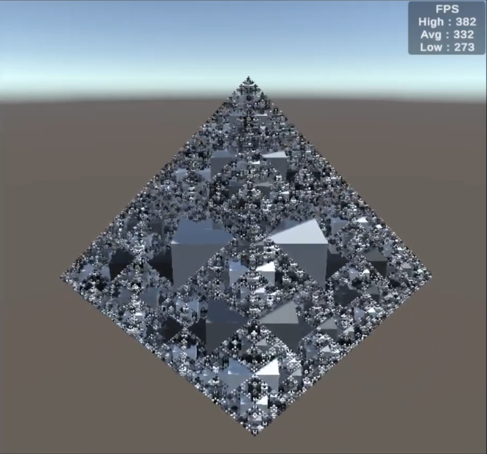
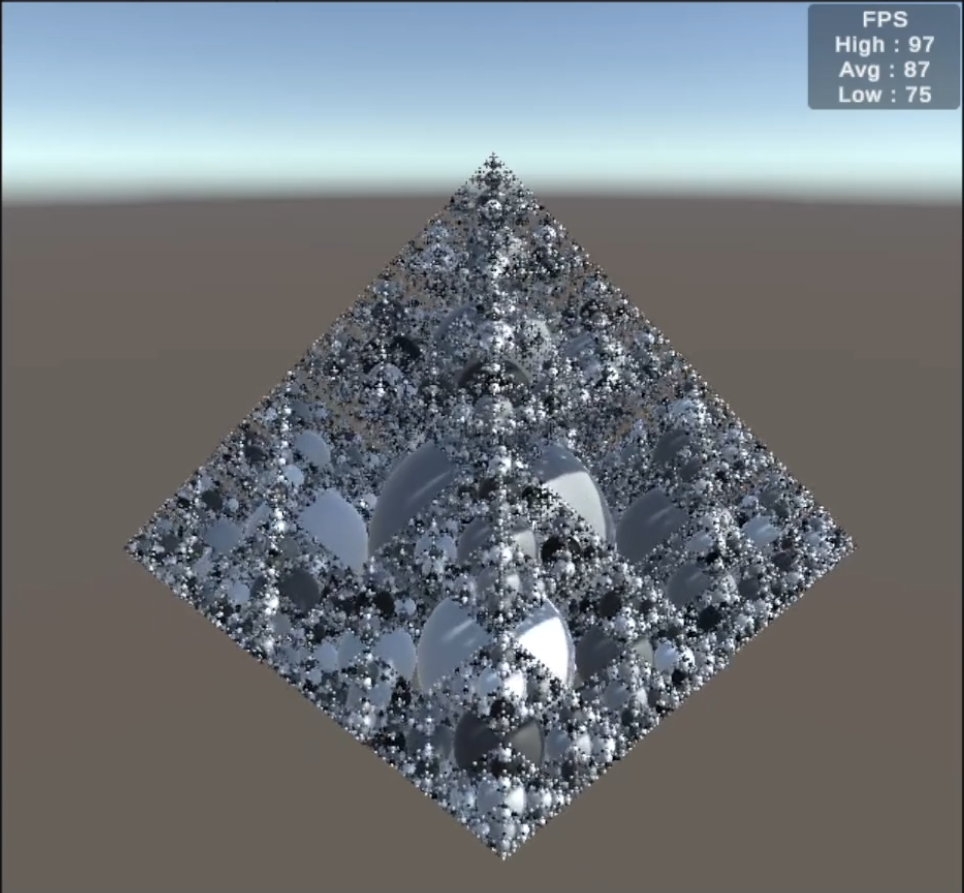
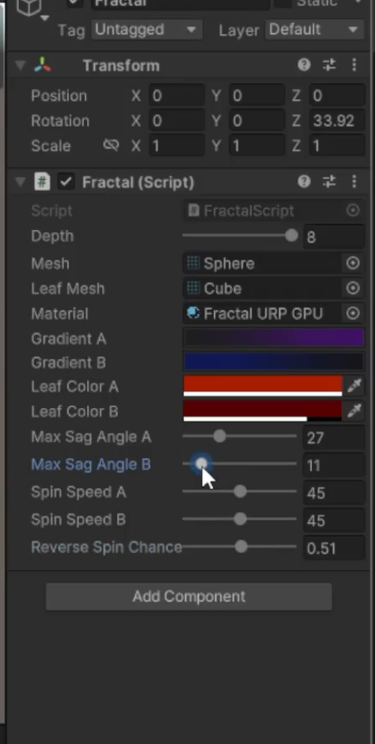

# Unity Basics
Working through catlikecoding's [Unity Basics](https://catlikecoding.com/unity/tutorials/basics/) tutorials. 

## Graph
#### Compute shader for animating parametric surfaces.

Shifting surfaces + adjusting the resolution slider. I think something around 100x100 looks the nicest for what this is. 

I realize this is pretty much *exactly* what the hardware was made for, but seeing how fast these operations are done still blows my mind.

## Fractal
### Burst compiler + parallelizing loops with jobs
 Cube mesh  @depth 8  | Sphere mesh @depth 8 
 :-------------------------:|:--------------------------: 
   | 
Before the optimizations I got ~5fps rendering a sphere-tree @depth 8. Performance improved by a factor of ~18x!

### Adding variety with animation and color
Cube-mesh leaf nodes + gradient colors + sagging axes

 organic fractal  | Inspector fields
 :-------------------------:|:--------------------------: 
  | 
